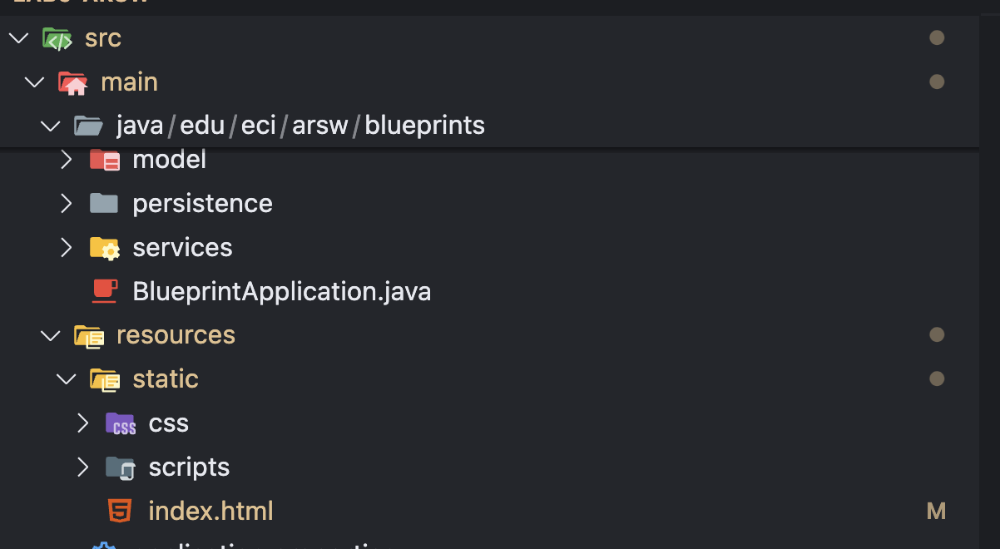
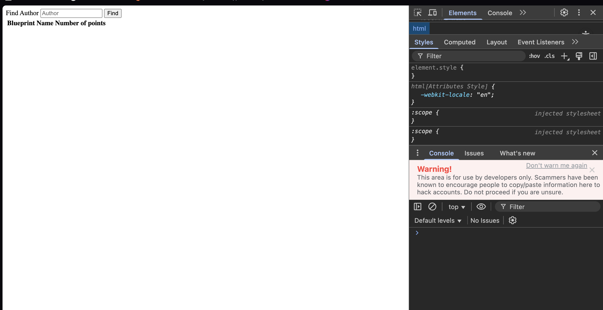
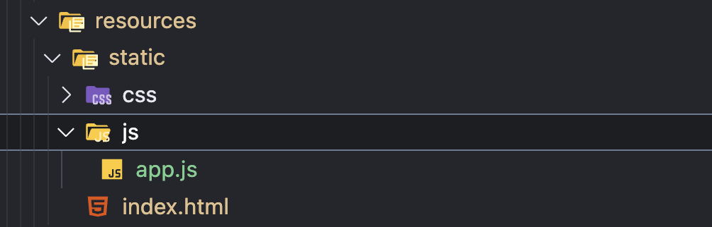
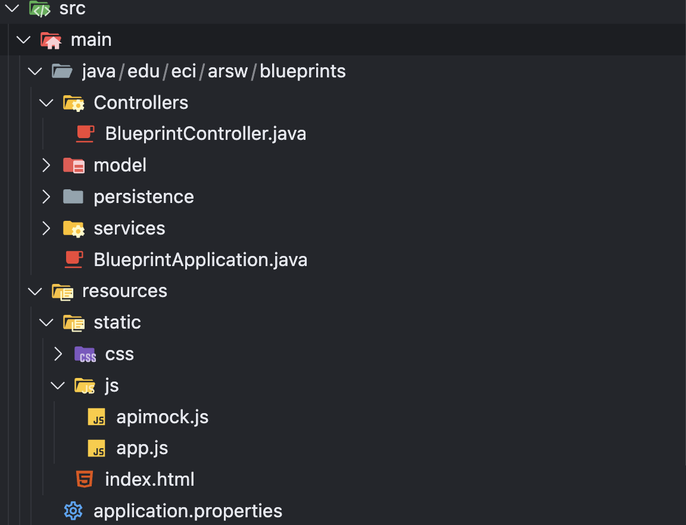

# FRONTEND

1. Create the directory where the JavaScript application will reside. Since SpringBoot is being used, the path to place static content (static web pages, HTML5/JS applications, etc.) is:

```sh
src/main/resources/static
```

I noticed that the resources folder was already created, but not in the correct path, so I moved it to `main` and created the corresponding files.


2. In the previous directory, create the index.html page with only the basics: a title, a field to enter the author's name, a 'Get blueprints' button, a field to display the selected author's name, an HTML table to show the list of blueprints (with only the headers), and a field to display the total number of points for the author's blueprints. Remember to assign identifiers to these components to make them easier to find using selectors.

```html
<!DOCTYPE html>
<html lang="en">
<head>
    <meta charset="UTF-8">
    <meta name="viewport" content="width=device-width, initial-scale=1.0">
    <title>Document</title>
    <script src="js/apimock.js"></script>
    <script src="js/app.js"></script>
    
</head>
<body>
    <label for="Author">Find Author</label>
    <input type="text" value="" placeholder="Author" id="inputFindAuthor">
    <button type="button" id="btnFindAuthor">Find</button>
    <table>
        <tr>
            <th>Blueprint Name</th>
            <th>Number of points</th>
        </tr>
    </table>
</body>
</html>
```

3. In the `<head>` element of the page, add references to the jQuery and Bootstrap libraries, as well as the Bootstrap stylesheet.

```html
<head>
    <meta charset="UTF-8">
    <meta name="viewport" content="width=device-width, initial-scale=1.0">
    <title>Document</title>
    <script src="/webjars/jquery/3.1.0/jquery.min.js"></script>
    <script src="/webjars/bootstrap/3.3.7/js/bootstrap.min.js"></script>
    <script src="js/apimock.js"></script>
    <script src="js/app.js"></script>

</head>
```

4. Start the application (`mvn spring-boot:run`) and verify:

That the page is accessible from:
```http://localhost:8080/index.html```
When opening the browser's developer console, there should NOT be any 404 error messages (i.e., the JavaScript libraries should load correctly).


## Front-End - Lógica

1. Now, create a JavaScript Module that acts as a controller, maintains the state, and provides the operations required by the view. To do this, follow the JavaScript Module pattern and create a module in the path `static/js/app.js`.



2. Copy the provided module (`apimock.js`) into the same directory as the previously created module. In this file, add more blueprints (with more points) to the hardcoded authors in the code.


3. Add the import statements for the two new modules to the HTML page (after the imports for the jQuery and Bootstrap libraries):

```html
<head>
    <meta charset="UTF-8">
    <meta name="viewport" content="width=device-width, initial-scale=1.0">
    <title>Document</title>
    <script src="/webjars/jquery/3.1.0/jquery.min.js"></script>
    <script src="/webjars/bootstrap/3.3.7/js/bootstrap.min.js"></script>
    <script src="js/apimock.js"></script>
    <script src="js/app.js"></script>

</head>
```

4. Make the previously created module maintain privately:

    - The name of the selected author.
    - The list of names and sizes of the blueprints of the selected author that is, a list of objects, where each object will have two properties: blueprint name, and number of points of the blueprint.
    - Along with a public operation that allows changing the currently selected author's name.

```js
    var App = (function(){
    let blueprints = []
    let currentAuthor = "";

    function printBlueprints(){
        const table = document.getElementById("blueprintTable")
        table.innerHTML = `
            <tr>
                <th>Blueprint Name</th>
                <th>Number of points</th>
            </tr>
        `;
        blueprints.forEach(bp => {
            let row = `<tr>
                        <td> ${bp.name}</td>
                        <td>${bp.points}</td>
                        </tr>`
            table.innerHTML += row
        })
    }

    return {
        setAuthor : function(author){
            currentAuthor = author

           apimock.getBlueprintsByAuthor(author, function(bps){
            if (!bps) {
                blueprints = [];
            } else {
                blueprints = bps.map(bp => ({
                    name: bp.name,
                    points: bp.points.length
                }));
            }
            printBlueprints();
    });
        },

        setBlueprints : function(blprnts){
            blueprints = blprnts
        },

        getAuthor: function(){
            return currentAuthor
        },

        getBlueprints: function(){
            return blueprints
        }
    }
})();
```
