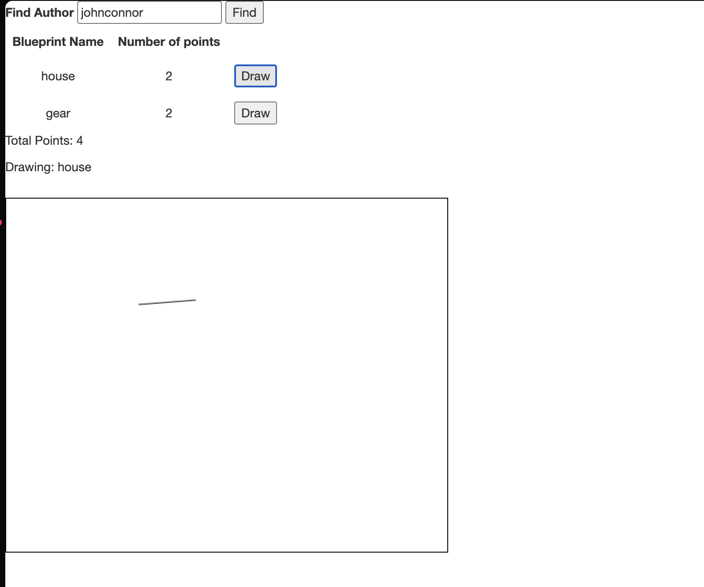
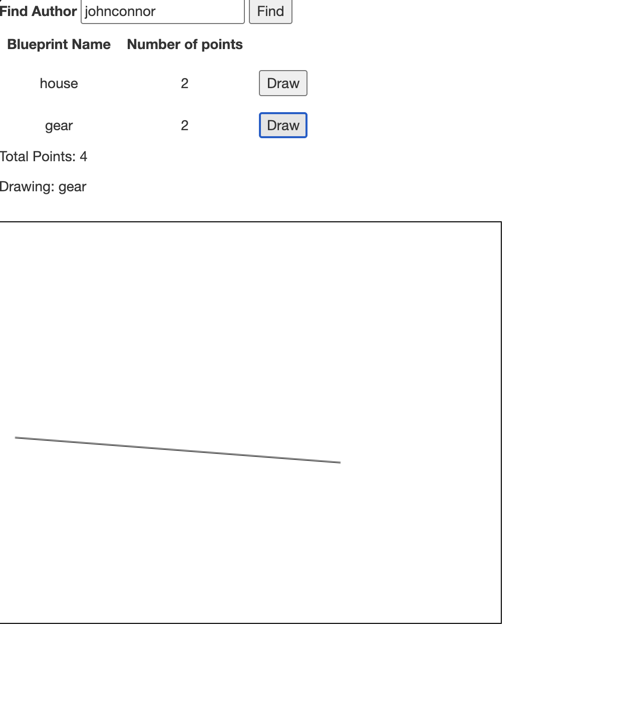
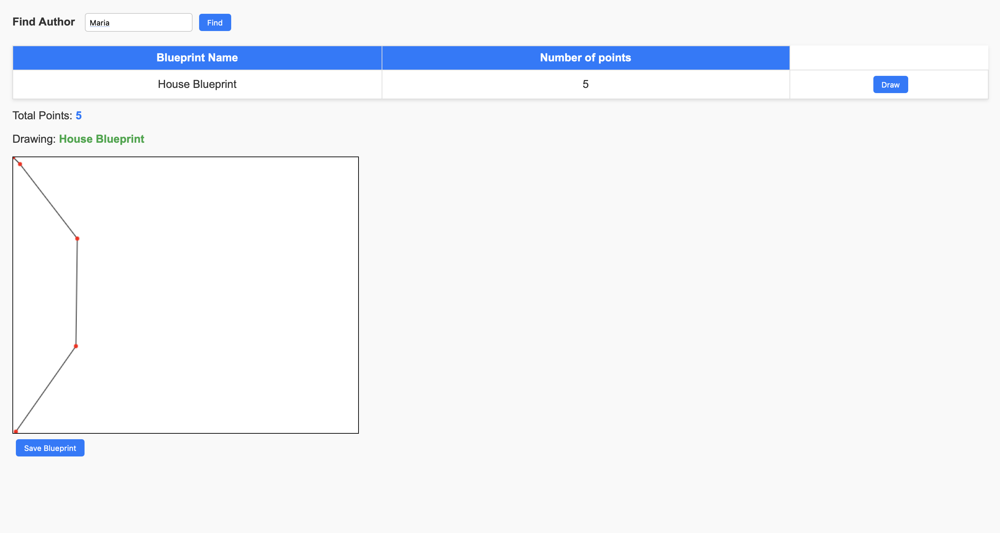
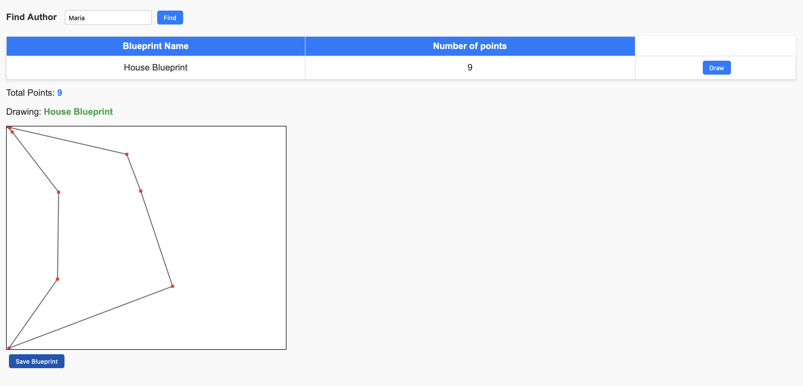

# FRONTEND

1. Create the directory where the JavaScript application will reside. Since SpringBoot is being used, the path to place static content (static web pages, HTML5/JS applications, etc.) is:

```sh
src/main/resources/static
```

I noticed that the resources folder was already created, but not in the correct path, so I moved it to `main` and created the corresponding files.


2. In the previous directory, create the index.html page with only the basics: a title, a field to enter the author's name, a 'Get blueprints' button, a field to display the selected author's name, an HTML table to show the list of blueprints (with only the headers), and a field to display the total number of points for the author's blueprints. Remember to assign identifiers to these components to make them easier to find using selectors.

```html
<!DOCTYPE html>
<html lang="en">
<head>
    <meta charset="UTF-8">
    <meta name="viewport" content="width=device-width, initial-scale=1.0">
    <title>Document</title>
    <script src="js/apimock.js"></script>
    <script src="js/app.js"></script>
    <link rel="stylesheet"
      href="/webjars/bootstrap/3.3.7/css/bootstrap.min.css" />
    
</head>
<body>
    <label for="Author">Find Author</label>
    <input type="text" value="" placeholder="Author" id="inputFindAuthor">
    <button type="button" id="btnFindAuthor">Find</button>
    <table>
        <tr>
            <th>Blueprint Name</th>
            <th>Number of points</th>
        </tr>
    </table>
</body>
</html>
```

3. In the `<head>` element of the page, add references to the jQuery and Bootstrap libraries, as well as the Bootstrap stylesheet.

```html
<head>
    <meta charset="UTF-8">
    <meta name="viewport" content="width=device-width, initial-scale=1.0">
    <title>Document</title>
    <script src="/webjars/jquery/3.1.0/jquery.min.js"></script>
    <script src="/webjars/bootstrap/3.3.7/js/bootstrap.min.js"></script>
    <link rel="stylesheet"
      href="/webjars/bootstrap/3.3.7/css/bootstrap.min.css" />
    <script src="js/apimock.js"></script>
    <script src="js/app.js"></script>

</head>
```

4. Start the application (`mvn spring-boot:run`) and verify:

That the page is accessible from:
```http://localhost:8080/index.html```
When opening the browser's developer console, there should NOT be any 404 error messages (i.e., the JavaScript libraries should load correctly).


## Front-End - Lógica

1. Now, create a JavaScript Module that acts as a controller, maintains the state, and provides the operations required by the view. To do this, follow the JavaScript Module pattern and create a module in the path `static/js/app.js`.


2. Copy the provided module (`apimock.js`) into the same directory as the previously created module. In this file, add more blueprints (with more points) to the hardcoded authors in the code.


3. Add the import statements for the two new modules to the HTML page (after the imports for the jQuery and Bootstrap libraries):

```html
<head>
    <meta charset="UTF-8">
    <meta name="viewport" content="width=device-width, initial-scale=1.0">
    <title>Document</title>
    <script src="/webjars/jquery/3.1.0/jquery.min.js"></script>
    <script src="/webjars/bootstrap/3.3.7/js/bootstrap.min.js"></script>
    <script src="js/apimock.js"></script>
    <script src="js/app.js"></script>

</head>
```

4. Make the previously created module maintain privately:

    - The name of the selected author.
    - The list of names and sizes of the blueprints of the selected author that is, a list of objects, where each ob|ject will have two properties: blueprint name, and number of points of the blueprint.
    - Along with a public operation that allows changing the currently selected author's name.

```js
    var App = (function(){
    let blueprints = []
    let currentAuthor = "";

    }

    return {

        setBlueprints : function(blprnts){
            blueprints = blprnts
        },

        getAuthor: function(){
            return currentAuthor
        },

        getBlueprints: function(){
            return blueprints
        }
    }
)();
```

5. Add a public operation to the 'app.js' module that allows updating the list of blueprints based on the author's name (given as a parameter). To do this, this operation should invoke the 'getBlueprintsByAuthor' operation from the provided 'apimock' module, passing as a callback a function that:

- Takes the list of blueprints and applies a 'map' function to convert its elements into objects containing only the name and the number of points.

```js

        updateBlueprints: function(author){
            currentAuthor = author;
            apimock.getBlueprintsByAuthor(author, (bps) => {
                let transformed = bps.map(bp => ({
                    name: bp.name,
                    points: bp.points.length
                }))})};
```

- On the resulting list, apply another 'map' that takes each of these elements and, using jQuery, adds a `<tr>` element (with the respective `<td>`) to the table created in step 4. Make sure to use jQuery selectors and refer to online tutorials as needed. For now, do not add buttons to the generated rows.

```js
            let $table = $("#blueprintTable");
            $table.empty(); 
            $table.append(`
                <tr>
                    <th>Blueprint Name</th>
                    <th>Number of points</th>
                </tr>
            `);

            transformed.map(bp => {
                let row = `<tr>
                            <td>${bp.name}</td>
                            <td>${bp.points}</td>
                        </tr>`;
                $table.append(row);
            });
```

- On either of the two lists (the original or the one transformed using 'map'), apply a 'reduce' function to calculate the total number of points. With this value, use jQuery to update the corresponding field within the DOM.

```js
        let totalPoints = transformed.reduce((acc, bp) => acc + bp.points, 0);
        $("#totalPoints").text(totalPoints);
```

6. Associate the previously created operation (from app.js) to the 'on-click' event of the query button on the page.

```html
<body>

    <label for="Author">Find Author</label>
    <input type="text" value="" placeholder="Author" id="inputFindAuthor">
    <button type="button" id="btnFindAuthor" onclick="App.updateBlueprints($('#inputFindAuthor').val())">Find</button>
    <table id="blueprintTable">
        <tr>
            <th>Blueprint Name</th>
            <th>Number of points</th>
        </tr>
        
        <tr>
        <td><strong>Total</strong></td>
        <td id="totalPoints">0</td>
        </tr>

    </table>

</body>
```

8. Add a Canvas element to the page, with its respective identifier. Make sure its dimensions are not too large to leave space for the other components, but large enough to 'draw' the blueprints.

```html
<body>

    <label for="Author">Find Author</label>
    <input type="text" value="" placeholder="Author" id="inputFindAuthor">
    <button type="button" id="btnFindAuthor" onclick="App.updateBlueprints($('#inputFindAuthor').val())">Find</button>
    <table id="blueprintTable">
        <tr>
            <th>Blueprint Name</th>
            <th>Number of points</th>
            <th>Draw</th>
        </tr>
        
        <tr>
        <td><strong>Total</strong></td>
        <td></td>
        </td>
        </tr>
    </table>
    <p>Total Points: <span id="totalPoints">0</span></p>
    <p>Drawing: <span id="currentBlueprint">None</span></p>
    <canvas id="blueprintCanvas" width="500" height="400" style="border:1px solid #000; margin-top:15px;"></canvas>
    
```

9. In the app.js module, add an operation that, given an author's name and the name of one of their blueprints as parameters, uses the getBlueprintsByNameAndAuthor method from apimock.js and a callback function to:

- Retrieve the points of the corresponding blueprint, and use them to consecutively draw line segments, making use of HTML5 elements (Canvas, 2DContext, etc.).
- Update with jQuery the field where the name of the blueprint being drawn is displayed (if this field does not exist, add it to the DOM).

```js
drawBlueprint: function(author,bpname){
        apimock.getBlueprintsByNameAndAuthor(author,bpname,function(bp){
            if (!bp){
                alert("Blueprint not found")
                return
            }
            $("#currentBlueprint").text(bp.name);
            let canvas = document.getElementById("blueprintCanvas");
            let ctx = canvas.getContext("2d");

            ctx.clearRect(0, 0, canvas.width, canvas.height);

            if (bp.points.length > 0) {
                ctx.beginPath();
                ctx.moveTo(bp.points[0].x, bp.points[0].y);

                for (let i = 1; i < bp.points.length; i++) {
                    ctx.lineTo(bp.points[i].x, bp.points[i].y);
                }

                ctx.stroke();
            }
        })
       }
```

10. Verify that the application now, in addition to displaying the list of an author's blueprints, allows selecting one of them and graphing it. To do this, make sure the rows generated in step 5 include, in the last column, a button with its click event associated to the previously created operation (sending the corresponding names as parameters).

```js
updateBlueprints: function(author){
            apimock.getBlueprintsByAuthor(author, function(bps){

            let transformed = bps.map(bp => ({
                name: bp.name,
                points: bp.points.length
            }));

           
            let $table = $("#blueprintTable");
            $table.empty(); 
            $table.append(`
                <tr>
                    <th>Blueprint Name</th>
                    <th>Number of points</th>
                </tr>
            `);

            transformed.map(bp => {
                let row = `<tr>
                            <td>${bp.name}</td>
                            <td>${bp.points}</td>
                            <td><button onclick="App.drawBlueprint('${author}', '${bp.name}')">Draw</button></td>

                        </tr>`;
                $table.append(row);
            });

          
            let totalPoints = transformed.reduce((acc, bp) => acc + bp.points, 0);

            
            $("#totalPoints").text(totalPoints);
        });
        }
```

11. Verify that the application now allows: querying an author's blueprints and graphing the one selected.




The code above defines a JavaScript module called `apiclient` that provides two operations for interacting with a REST API:

- `getBlueprintsByAuthor(author, callback)`: Makes a GET request to the endpoint `/api/blueprints/{author}` to retrieve all blueprints for the specified author. On success, it calls the provided callback with the data. If the request fails, it shows an alert with an error message.
- `getBlueprintsByNameAndAuthor(author, name, callback)`: Makes a GET request to `/api/blueprints/{author}/{name}` to retrieve a specific blueprint by author and name. On success, it calls the callback with the blueprint data. On failure, it shows an alert.

Both methods use jQuery's `$.get()` for asynchronous HTTP requests and handle callbacks to process the returned data.

```js
var apiclient = (function(){
    const url = "http://localhost:8080/api/blueprints";

    return {
        getBlueprintsByAuthor: function(author, callback){
            $.get(url + "/" + author, function(data){
                callback(data);
                console.log(data)
            }).fail(function() {
                alert("Error retrieving blueprints for author: " + author);
            });
        },

        getBlueprintsByNameAndAuthor: function(author, name, callback){
            $.get(url + "/" + author + "/" + name, function(data){
                callback(data);
            }).fail(function() {
                alert("Error retrieving blueprint: " + name + " for author: " + author);
            });
        }
    }
})();
```

13. Modify the app.js code so that it is possible to switch between 'apimock' and 'apiclient' with just one line of code.

In `app.js` I added the next line and used it in the `getBlueprintsByAuthor` and `getBlueprintsByNameAndAuthor` methods

```js
let api = apiclient
```

14. Review the documentation and examples of Bootstrap styles (already included in the exercise), and add the necessary elements to the page to make it more visually appealing and closer to the mockup given at the beginning of the instructions.

review `styles.css` file

15. I deployed it to Azure so I modified the url but the functionality is the same
link: <https://blueprints-e2f7gcd4c0aqcsg2.canadacentral-01.azurewebsites.net>

# PARTE 3

1. Add an event handler to the page canvas that allows you to capture clicks made either with the mouse or via a touchscreen. To do this, consider this example of using ‘PointerEvent’ events (not yet supported by all browsers) for this purpose. Remember that unlike the previous example (where the JS code is embedded in the view), the initialization of event handlers is expected to be properly modularized, as shown in this codepen.

```js
initCanvas: function(canvasId){
           const canvas = document.getElementById(canvasId);
           if(!canvas) {
               console.warn('Canvas not found:', canvasId);
               return;
           }
           const ctx = canvas.getContext('2d');

           function getCanvasRelativePos(evt){
               const rect = canvas.getBoundingClientRect();
               let clientX = 0, clientY = 0;

              
               if (typeof TouchEvent !== 'undefined' && evt instanceof TouchEvent) {
                   if (evt.touches && evt.touches.length>0) {
                       clientX = evt.touches[0].clientX;
                       clientY = evt.touches[0].clientY;
                   } else if (evt.changedTouches && evt.changedTouches.length>0) {
                       clientX = evt.changedTouches[0].clientX;
                       clientY = evt.changedTouches[0].clientY;
                   }
               } else if (typeof PointerEvent !== 'undefined' && evt instanceof PointerEvent) {
                   clientX = evt.clientX;
                   clientY = evt.clientY;
               } else if (typeof MouseEvent !== 'undefined' && evt instanceof MouseEvent) {
                   clientX = evt.clientX;
                   clientY = evt.clientY;
               } else if (evt.touches && evt.touches.length>0) {
                   clientX = evt.touches[0].clientX;
                   clientY = evt.touches[0].clientY;
               } else if (evt.changedTouches && evt.changedTouches.length>0) {
                   clientX = evt.changedTouches[0].clientX;
                   clientY = evt.changedTouches[0].clientY;
               } else if ('clientX' in evt && 'clientY' in evt) {
                   clientX = evt.clientX;
                   clientY = evt.clientY;
               }

               return {
                   x: Math.round(clientX - rect.left),
                   y: Math.round(clientY - rect.top)
               };
           }

           function drawMarker(x,y){
               ctx.save();
               ctx.fillStyle = 'red';
               ctx.beginPath();
               ctx.arc(x,y,3,0,2*Math.PI);
               ctx.fill();
               ctx.restore();
           }

           function handlePointer(e){
               if(e.preventDefault) e.preventDefault();
               const pos = getCanvasRelativePos(e);
               console.log('Canvas click at:', pos);
               drawMarker(pos.x,pos.y);

               const $tp = $('#totalPoints');
               const current = parseInt($tp.text()) || 0;
               $tp.text(current + 1);
           }

           if(window.PointerEvent){
               canvas.addEventListener('pointerdown', handlePointer);
           } else {
               canvas.addEventListener('touchstart', function(e){ handlePointer(e); }, {passive:false});

               canvas.addEventListener('mousedown', handlePointer);
           }

           canvas.clearMarkers = function(){
               ctx.clearRect(0,0,canvas.width,canvas.height);
           };
       }
```

2. Add the necessary functionality to your modules so that when new points are captured on the open canvas (if no canvas is selected, NOTHING should happen):

- The point is added to the end of the sequence of points for the current canvas (only in the application's memory, NOT YET IN THE API!).
- The drawing is repainted.

```js

               if(!currentBlueprint){
                   console.log('No blueprint selected; ignoring canvas click.');
                   return;
               }

               if(!currentBlueprint.points) currentBlueprint.points = [];
               currentBlueprint.points.push({x: pos.x, y: pos.y});

               ctx.clearRect(0,0,canvas.width,canvas.height);
               if(currentBlueprint.points.length > 0){
                   ctx.beginPath();
                   ctx.moveTo(currentBlueprint.points[0].x, currentBlueprint.points[0].y);
                   for(let i=1;i<currentBlueprint.points.length;i++){
                       ctx.lineTo(currentBlueprint.points[i].x, currentBlueprint.points[i].y);
                   }
                   ctx.stroke();
               }
               ctx.fillStyle = 'red';
               for(let p of currentBlueprint.points){
                   ctx.beginPath();
                   ctx.arc(p.x,p.y,3,0,2*Math.PI);
                   ctx.fill();
               }

               const $tp = $('#totalPoints');
               const current = parseInt($tp.text()) || 0;
               $tp.text(current + 1);
           }
              if(window.PointerEvent){
                canvas.addEventListener('pointerdown', handlePointer);
              } else {
                canvas.addEventListener('touchstart', function(e){ handlePointer(e); }, {passive:false});
                canvas.addEventListener('mousedown', handlePointer);
                }
              }
              canvas.clearMarkers = function(){
                ctx.clearRect(0,0,canvas.width,canvas.height);
                };
         }
```

3. Add the Save/Update button. Following the current modular architecture of the client, ensure that when the button is pressed:

- A PUT request is made to the API with the updated blueprint, targeting its corresponding REST resource.
- A GET request is made to the `/blueprints` resource to retrieve all the blueprints again.
- The total points for the user are recalculated.

```js
aveCurrentBlueprint: function(){
            if(!currentBlueprint){
                alert('No blueprint selected to save.');
                return;
            }
            const author = currentBlueprint.author;
            const name = currentBlueprint.name;
            api.putBlueprint(author, name, currentBlueprint, function(err, resp){
                if(err){
                    alert('Error saving blueprint: ' + err);
                    return;
                }
               
                api.getAllBlueprints(function(getErr, data){
                    if(getErr){
                        alert('Error retrieving blueprints after save: ' + getErr);
                        return;
                    }
                    blueprints = data;

                    const authorBps = data.filter(b => b.author === author);
                    const totalPoints = authorBps.reduce((acc,bp) => acc + (bp.points?bp.points.length:0), 0);
                    $('#totalPoints').text(totalPoints);


                    try{
                        if($('#inputFindAuthor').val() === author){
                            App.updateBlueprints(author);
                        }
                    }catch(e){
                    }
                });
            });
        }
    }
})();
```

the button in the html file

```html
<button type="button" id="btnSaveBlueprint" onclick="App.saveCurrentBlueprint()">Save</button>
```

Before:


After:


4. Add the 'Create new blueprint' button so that when pressed:

- The current canvas is cleared.  
- The name of the new 'blueprint' is requested (you decide how to prompt for this).
- This option should modify how the 'save/update' functionality works, as in this case, when pressed for the first time, it should (also using promises):

I. Make a POST request to the `/blueprints` resource to create the new blueprint.  
II. Make a GET request to the same resource to update the list of blueprints and the user's total points.  

```js
createNewBlueprint: function(){
            const canvas = document.getElementById('blueprintCanvas');
            if(canvas){
                const ctx = canvas.getContext('2d');
                ctx.clearRect(0,0,canvas.width,canvas.height);
            }

            let author = $('#inputFindAuthor').val();
            if(!author){
                author = prompt('Enter author name for the new blueprint:');
                if(!author) return; 
                $('#inputFindAuthor').val(author);
            }

            const name = prompt('Enter name for the new blueprint:');
            if(!name) return; 

            currentBlueprint = { author: author, name: name, points: [] };
            isNewBlueprint = true;
            $('#currentBlueprint').text(name);

            api.getAllBlueprints(function(getErr, data){
                if(getErr){ console.warn('Could not refresh blueprints after create init:', getErr); return; }
                blueprints = data;
                const authorBps = data.filter(b => b.author === author);
                const totalPoints = authorBps.reduce((acc,bp) => acc + (bp.points?bp.points.length:0), 0);
                $('#totalPoints').text(totalPoints);
                // refresh table if author selected
                try{ if($('#inputFindAuthor').val() === author){ App.updateBlueprints(author); } }catch(e){}
            });
        }
```


5. Add the 'DELETE' button so that (also using promises):

Clear the canvas.  

- Make a DELETE request to the corresponding resource.  
- Make a GET request to retrieve the now available blueprints.  

```js
deleteBlueprint: function(author, name){
            return new Promise(function(resolve, reject){
                $.ajax({
                    url: url + "/blueprint" + "/" + name,
                    type: 'DELETE'
                }).done(function(resp){
                    resolve(resp);
                }).fail(function(jqxhr, status, err){
                    const body = jqxhr && jqxhr.responseText ? jqxhr.responseText : (err || status || 'error');
                    reject(body);
                });
            });
        }
```

```js
transformed.map(bp => {
                let row = `<tr>
                            <td>${bp.name}</td>
                            <td>${bp.points}</td>
                            <td><button onclick="App.drawBlueprint('${author}', '${bp.name}')">Draw</button></td>
                            <td><button onclick="App.deleteBlueprint('${author}', '${bp.name}')">Delete</button></td>

                        </tr>`;
                $table.append(row);
            });
````


